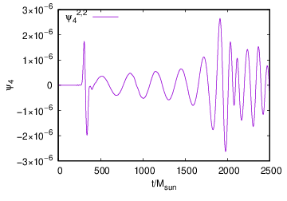

<!-- markdown="1" is needed to get markdown inside of the div -->

Gallery: Binary, inspiraling neutron stars forming a hypermassive neutron star
==============================================================================

This simulation shows how to evolve a pair of neutron stars, reading in initial
data provided by the [LORENE](http://www.lorene.obspm.fr/) code. The video shows the rest mass density in
an equatorial slice of the simulation. The emitted gravitational waves of the
inspiral and due to the oscillations in the formed hypermassive neutron star
are shown as well.

| Parameter file        | [NsNsToHMNS.par](nsnstohmns.par) |
| Thornlist             | [NsNsToHMNS.th](NsNsToHMNS.th) (Thorn NSTracker added to release) |
| Initial data file     | [G2_I12vs12_D4R33T21_45km.resu.xz](G2_I12vs12_D4R33T21_45km.resu.xz) (uncompress using unxz) |
| Support scripts       | [scripts.tar.gz](scripts.tar.gz) |
| approx. memory        | 8.8 GB |
| approx. runtime       | 12\*48 SU |

  

    Loading the player...
    Download movie: <a href="rho.mp4">rho.mp4</a> 
     
     
  

